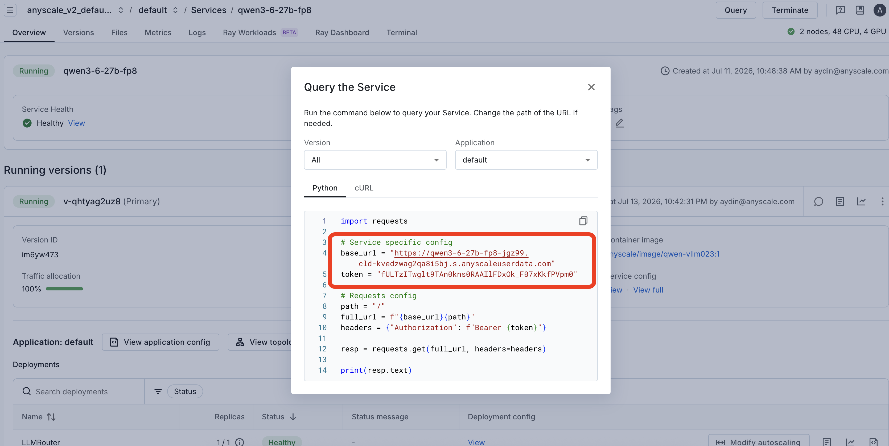

# Part 2 — Connect your coding agent to the served model

Two paths, split by how each agent reaches the model:

| Agent | How it connects |
|---|---|
| **Claude Code** | a model served in a workspace, over an SSH tunnel → `localhost:8000` (`/v1/messages`), with Brave web-search MCP |
| **Cursor** | a public Anyscale Service (`/v1/chat/completions`) — its cloud can't reach `localhost` |

Both endpoints run **direct streaming**, which exposes vLLM's native `/v1/messages` (Anthropic) and `/v1/chat/completions` (OpenAI) — no proxy, no `pip install`.

## Claude Code — workspace model + web search

Claude Code runs on your machine, so it reaches the workspace model directly over an SSH tunnel — no public endpoint needed.

Prereqs: the model is served in a workspace on `localhost:8000`; `export BRAVE_API_KEY=…`.

1. Open the tunnel (leave it running):
   ```bash
   anyscale workspace_v2 ssh -n <workspace> -- -N -L 8000:localhost:8000
   ```
2. Launch from this folder (so `.mcp.json` loads):
   ```bash
   cd part2-connect-clients-direct && ./claude-workspace.sh
   ```

`claude-workspace.sh` points Claude Code at `localhost:8000` with a dummy token and pins every model tier to `qwen3.6-27b`. `.mcp.json` adds a local **Brave Search** MCP server for web search — Anthropic's built-in `WebSearch`/`WebFetch` don't work on a self-hosted model. First turn is slow (reasoning model on 4× L4) — not a hang.

## Cursor — public service

Cursor routes every call through its own cloud, which refuses `localhost`/private IPs (`Access to private networks is forbidden`), so it needs a **public HTTPS** endpoint — an Anyscale Service, not the workspace tunnel (a tunnel only opens the port on your own machine).

**Shared service URL + token** — use these:

```
base_url = https://qwen3-6-27b-fp8-jgz99.cld-kvedzwag2qa8i5bj.s.anyscaleuserdata.com
token    = fULTzITwglt9TAn0kns0RAAIlFDxOk_F07xKkfPVpm0
```

They come from the Anyscale console → **Services → the service → Query** (click **Query**, then copy `base_url` + `token` from the panel):




**Cursor Settings → Models → OpenAI API Key:**

1. Enable **Override OpenAI Base URL** → the base URL **with `/v1` appended**:
   `https://qwen3-6-27b-fp8-jgz99.cld-kvedzwag2qa8i5bj.s.anyscaleuserdata.com/v1`
2. Set **OpenAI API Key** → the token above (`fULTzITwglt9TAn0kns0RAAIlFDxOk_F07xKkfPVpm0`).
3. **Add a custom model** named `qwen3.6-27b` — must match the `model_id` set in the serve app's `LLMConfig`; it's the only id the server answers to. Enable it, and disable the default models.
4. **Verify**, then in chat pick `qwen3.6-27b` and send "say hi in 3 words".

Chat/Ask work well; Tab and parts of Agent/Composer are tuned for Cursor's own models.

## Troubleshooting

| Symptom | Fix |
|---|---|
| `claude-workspace.sh`: "not reachable" | Workspace down or tunnel closed — (re)open the tunnel. |
| Brave MCP tools don't appear | `export BRAVE_API_KEY=…`, and launch from this folder so `.mcp.json` loads. |
| Claude Code: "both token and key set" | Clear inherited `ANTHROPIC_API_KEY`; the launcher uses `ANTHROPIC_AUTH_TOKEN`. |
| Cursor: "Access to private networks is forbidden" | Expected for `localhost` — use the public service URL. |
| Cursor: model not found | The custom-model name must equal the `LLMConfig` `model_id` (`qwen3.6-27b`) exactly. |
| First request times out | Service/model cold-starting; warm it with one small request (a single request past 300s hits the ALB `504`). |

Back: [Part 1 — deploy with direct streaming](../part1-deploy-naive/README.md)
