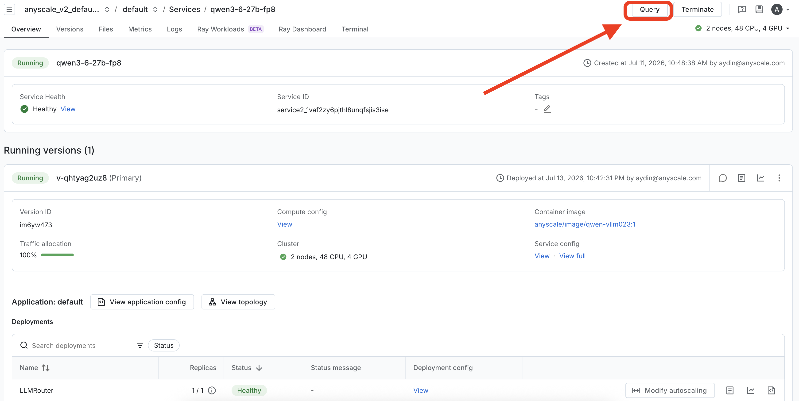

# Part 2 (production) — connect via the public Anyscale Service

The production pattern: deploy `qwen3.6-27b` as an **Anyscale Service** (Part 1's `service_naive.yaml`,
or Part 3's optimized service) and point your agents at its **public HTTPS URL + token**. Direct
streaming exposes all three native APIs from the one service:

| Agent | Endpoint | Launch |
|---|---|---|
| **Claude Code** | `/v1/messages` | `./claude-service.sh` |
| **Codex** | `/v1/responses` | `./codex-service.sh` |
| **Cursor** | `/v1/chat/completions` | GUI (below) |

> The [workspace method](../part2-connect-clients-workspace/README.md) is quickest for local play (no
> public URL needed). Use this **service** path when you want a shareable endpoint, or for **Cursor** —
> which routes through its own cloud and can't reach `localhost`.

## Set your service URL + token

The launcher scripts have **no baked-in service** — they use yours. Get both from the Anyscale console →
**Services → your service → Query** (click **Query**, then copy `base_url` + `token`). When you run a
script it **prompts** for whatever isn't already set; to skip the prompts, export them first (append
`/v1` to the `base_url`):

```bash
export ANYSCALE_BASE_URL=https://<your-service>.s.anyscaleuserdata.com/v1   # base_url + /v1
export ANYSCALE_API_KEY=<your service bearer token>
```




## Claude Code / Codex (terminal)

Run from **this folder** so the Brave MCP config loads (`.mcp.json`, `.codex/config.toml`). Each script
prompts for your service URL + token if they aren't already exported:

```bash
export BRAVE_API_KEY=…        # web search via the local Brave MCP

./claude-service.sh           # Claude Code -> /v1/messages
./codex-service.sh            # Codex -> /v1/responses  (npm i -g @openai/codex)
```

Both scripts take `ANYSCALE_BASE_URL` / `ANYSCALE_API_KEY` from your environment, prompting for either
one that isn't set, and pin the model to `qwen3.6-27b`. Claude Code's `/v1/messages` needs the service
on **vLLM ≥ 0.23** (0.22 rejects a `system` role inside `messages[]`).

## Cursor (GUI)

Cursor routes calls through its own cloud, which refuses `localhost`/private IPs — so it needs the
public service URL (it can't use the workspace tunnel). In **Cursor Settings → Models → OpenAI API Key**:

1. Enable **Override OpenAI Base URL** → your service base URL **with `/v1` appended**
   (e.g. `https://<your-service>.s.anyscaleuserdata.com/v1`).
2. Set **OpenAI API Key** → your service token (from the **Query** panel).
3. **Add a custom model** named `qwen3.6-27b` — it must match the `model_id` in the serve app's
   `LLMConfig`; it's the only id the server answers to. Enable it, and disable the default models.
4. **Verify**, then pick `qwen3.6-27b` in chat and send "say hi in 3 words".

Chat/Ask work well; Tab and parts of Agent/Composer are tuned for Cursor's own models.

## Troubleshooting

| Symptom | Fix |
|---|---|
| First request times out | Service/model cold-starting; warm it with one small request (a single request past 300s hits the ALB `504`). |
| Cursor: "Access to private networks is forbidden" | Expected for `localhost` — use the public service URL. |
| Cursor / model not found | The custom-model name must equal the `LLMConfig` `model_id` (`qwen3.6-27b`) exactly. |
| Claude Code: 400 on `/v1/messages` | The service needs **vLLM ≥ 0.23**; 0.22 rejects a `system` role inside `messages[]`. |
| Codex: tool call returns "unsupported call" | Update Codex — dispatching MCP tools over a custom (non-OpenAI) provider needs a recent build. |

Back: [Part 1](../part1-deploy-naive/README.md) · Optimized service: [Part 3](../part3-optimize/README.md)
