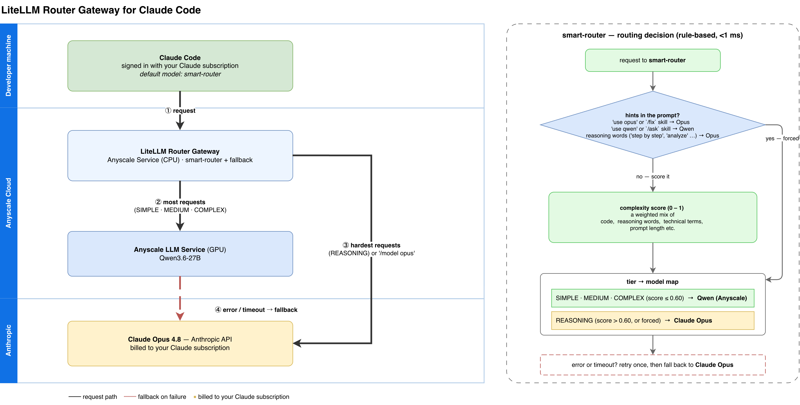

# Part 4 — Combine the Anyscale Model with Claude via LiteLLM

Parts 1–3 send **all** Claude Code traffic to the self-hosted `qwen3.6-27b` service. Part 4 deploys a
**LiteLLM gateway as a second (CPU-only) Anyscale Service** in front of it, so one endpoint combines
your open model with Anthropic's Claude models:

- **Defaults every Claude Code request to your own model** (`anyscale-qwen3.6-27b`).
- **Automatically falls back to Claude Opus** when your model errors or times out — authenticated with
  **each user's own Claude Max/Pro subscription** (OAuth passthrough, no shared org API key).
- Lets users **switch models on the fly** from inside Claude Code (`/model`), including a
  `smart-router` that picks local vs Opus per request by prompt complexity.

> **This part is a template.** One local model + Claude Opus + a router is the minimal working
> shape — edit `gateway/config.yaml` (see its "TO SWAP THE BACKEND MODEL" header) to build your own
> mix:
>
> - **Other Anthropic models:** copy the `claude-opus-4-8` entry and change the model, e.g. Fable 5
>   (`anthropic/claude-fable-5`). Leave `api_key` unset so the per-user OAuth passthrough keeps
>   working, then reference the new name wherever it should participate (`tiers`,
>   `router_settings.fallbacks`, or just `/model`).
> - **Multiple self-hosted models:** Ray Serve LLM can serve several models from one Anyscale
>   service (one `LLMConfig` per model — `/v1/models` lists them all), or you can run separate
>   services. Add one `model_list` entry per served model, then route between them with the
>   smart-router `tiers` and `keyword_tier_rules` — e.g. SIMPLE → a small local model,
>   MEDIUM/COMPLEX → `qwen3.6-27b`, REASONING → a Claude model.



The editable source is [`architecture_diagram.drawio`](./architecture_diagram.drawio); the right
panel's decision flow is explained in [`ROUTING.md`](./ROUTING.md).

## Layout

| File | Purpose |
|---|---|
| [`gateway/service.yaml`](./gateway/service.yaml) | Anyscale Service config (CPU-only, ingress auth OFF — see below) |
| [`gateway/serve_litellm.py`](./gateway/serve_litellm.py) | Ray Serve deployment that runs the `litellm` proxy on an internal port per replica and reverse-proxies to it |
| [`gateway/config.yaml`](./gateway/config.yaml) | LiteLLM router config: models, fallbacks, OAuth passthrough, smart router + keyword rules |
| [`gateway/custom_callbacks.py`](./gateway/custom_callbacks.py) | Pre-call hook that scrubs the forwarded Claude OAuth header on the local-backend path (without it, every request silently falls back to Opus) |
| [`gateway/requirements.txt`](./gateway/requirements.txt) | Version-pinned gateway deps: `litellm[proxy]==1.93.0`, `anthropic`, `prisma` |
| [`gateway/Containerfile`](./gateway/Containerfile) | Optional production image (bake deps in to skip the slow per-deploy pip install) |
| [`run-claude-router.sh`](./run-claude-router.sh) | Launch Claude Code against the gateway in OAuth-passthrough mode |
| [`client.py`](./client.py) | Smoke test (OpenAI SDK) for `anyscale-qwen3.6-27b` + `smart-router` |
| [`ROUTING.md`](./ROUTING.md) | How `smart-router` decides (keyword overrides → reasoning override → complexity score) and how to customize it |
| [`architecture_diagram.drawio`](./architecture_diagram.drawio) | Draw.io source for the architecture + decision-flow diagram (PNG export alongside) |

The four files in `gateway/` must stay together: `serve_litellm.py` loads `config.yaml` from its own
directory, LiteLLM imports `custom_callbacks.py` relative to `config.yaml`, and `service.yaml`
references `requirements.txt` + `serve_litellm:entrypoint` relative to the deploy CWD
(`working_dir: .`).

## 1. Fill in Endpoints and Secrets

Edit `gateway/service.yaml` `env_vars` (or pass them with `--env` at deploy time so the file stays
key-free):

| Env var | What it is |
|---|---|
| `LOCAL_LLM_MODEL` | `anthropic/<served-id>` for the LLM service's **native Anthropic** `/v1/messages` endpoint, e.g. `anthropic/qwen3.6-27b`. This requires direct streaming (Part 1 enables it) and preserves the model's signed thinking blocks. Use `openai/<id>` only if your backend speaks solely OpenAI. |
| `LOCAL_LLM_BASE_URL` | Your Part 1/3 service **ROOT** URL, **no `/v1`** (LiteLLM appends `/v1/messages`) |
| `LOCAL_LLM_AUTH_HEADER` | The LLM service auth header value: `Bearer <your-service-token>` |
| `LITELLM_MASTER_KEY` | A strong random key clients use to reach the gateway: `python3 -c 'import secrets; print("sk-" + secrets.token_urlsafe(32))'` |

## 2. Deploy the Gateway

Deploy **from the `gateway/` directory** — `working_dir: .` and `requirements.txt` resolve relative to
your CWD, not to `service.yaml`:

```bash
cd part4-litellm-router/gateway
anyscale service deploy -f service.yaml

# Production alternative (bakes deps into the image, skips the slow per-deploy
# pip install): remove image_uri + requirements from service.yaml, then:
# anyscale service deploy -f service.yaml --containerfile ./Containerfile
```

Expect the first rollout to take ~10–20 min (the image pip-installs `litellm[proxy]` + `prisma` at
startup). Watch it with `anyscale service status --name litellm-router-gateway`.

**There is no Anyscale bearer token for this service** — it runs with ingress auth **disabled**
(`query_auth_token_enabled: false`). That is deliberate: Anyscale ingress auth uses the
`Authorization` header, which must stay free to carry each user's Claude OAuth token. The gateway is
protected by `LITELLM_MASTER_KEY` instead, sent as the `x-litellm-api-key` header. Keep the key
secret and rotate it if it leaks.

## 3. Smoke-Test

```bash
cd ..
cp .env.example .env
$EDITOR .env      # set GATEWAY_BASE_URL + LITELLM_MASTER_KEY
set -a && source .env && set +a

# List exposed models
curl -sS "$GATEWAY_BASE_URL/v1/models" -H "x-litellm-api-key: Bearer $LITELLM_MASTER_KEY"

# Anthropic Messages API — the exact surface Claude Code uses
curl -sS "$GATEWAY_BASE_URL/v1/messages" \
  -H "x-litellm-api-key: Bearer $LITELLM_MASTER_KEY" \
  -H "anthropic-version: 2023-06-01" -H "content-type: application/json" \
  -d '{"model":"anyscale-qwen3.6-27b","max_tokens":128,"messages":[{"role":"user","content":"hi"}]}'

# Or the Python smoke test (tests anyscale-qwen3.6-27b + smart-router)
python client.py
```

Claude-backed models (`claude-opus-4-8`, and `smart-router` when it escalates a hard task) do **not**
work from curl or `client.py` — they need a Claude OAuth token, which only Claude Code forwards. An
auth error on the Claude path from a plain client is expected.

## 4. Launch Claude Code

```bash
./run-claude-router.sh
```

- If prompted, log in with **"Claude account with subscription"** — this is the OAuth token the
  gateway forwards to Anthropic on the Claude path.
- Verify with `/status`: the login method should be your **Claude account**, not
  `ANTHROPIC_AUTH_TOKEN` / `ANTHROPIC_API_KEY`.

Switch models on the fly:

| In Claude Code | Effect |
|---|---|
| `/model anyscale-qwen3.6-27b` | Force your Anyscale model |
| `/model claude-opus-4-8` | Force Claude Opus (uses your subscription) |
| `/model smart-router` | Automatic complexity-based routing (the default) |

You can also steer `smart-router` in-prompt: `use opus` forces Claude, `use qwen` / `use local`
forces the Anyscale model. Skill invocations route too: `/fix` (workload debugging) forces Claude
Opus, `/ask` (Ray/Anyscale Q&A) stays local. See [`ROUTING.md`](./ROUTING.md) for the full decision
flow.

## How the Pieces Fit

- **Default → smart-router**: the launcher sets `ANTHROPIC_MODEL` and every tier override
  (`ANTHROPIC_DEFAULT_{OPUS,SONNET,HAIKU}_MODEL`, `ANTHROPIC_SMALL_FAST_MODEL`) to `smart-router`, so
  all Claude Code traffic goes through the gateway's complexity router. Most turns stay local; only
  the hardest go to Opus.
- **Fallback → Claude, per-user billing**: `gateway/config.yaml` sets
  `forward_client_headers_to_llm_api: true` and the `claude-opus-4-8` entry has **no API key**, so
  the caller's Claude OAuth bearer is forwarded to Anthropic. `router_settings.fallbacks` routes
  `anyscale-qwen3.6-27b → claude-opus-4-8` after one retry.
- **Local path stays local**: `custom_callbacks.py` strips the forwarded OAuth header only on
  requests to `LOCAL_LLM_BASE_URL`, so the Anyscale service sees its own bearer token while the Opus
  fallback keeps the user's OAuth token.
- **Why a reverse proxy instead of `@serve.ingress`**: the fastapi/starlette versions in the Anyscale
  image make a decorated FastAPI app unpicklable, and pinning older fastapi breaks LiteLLM's
  streaming dep. `serve_litellm.py` instead runs the real `litellm` proxy on a localhost port per
  replica and reverse-proxies all HTTP (streaming SSE included) to it.

## Caveats

- Automatic fallback triggers on **errors / timeouts / rate limits / 5xx** — not on a low-quality
  answer returned with HTTP 200.
- Fallback bills against **that user's** Claude Max/Pro limits; if they're exhausted, fallback fails too.
- The gateway is reachable by anyone with the URL **and** a valid `LITELLM_MASTER_KEY`. For real
  teams, prefer per-user virtual keys (needs Postgres — set `DATABASE_URL` and uncomment
  `database_url` in `gateway/config.yaml`).
- Non-Claude models behind Claude Code is **LiteLLM community-supported**, not officially supported
  by Anthropic; new Claude Code features can temporarily break until LiteLLM supports their request
  format.
- `smart-router` uses LiteLLM's `auto_router/complexity_router`, verified against **LiteLLM 1.93.0**.
  Keep the version pinned; these config fields can move between releases.

## Troubleshooting

Issues hit while getting this live — the fixes are already baked into these files:

| Symptom | Root cause | Fix (applied) |
|---|---|---|
| Rollout UNHEALTHY: `No matching distribution found for litellm>=1.94.0` | `litellm` 1.94.x isn't on PyPI as a stable release | Pinned `litellm[proxy]==1.93.0` |
| Claude OAuth passthrough can't work | Anyscale ingress auth consumes the `Authorization` header | `query_auth_token_enabled: false`; gateway auth moved to `x-litellm-api-key` |
| Build fails: `cannot pickle '_thread.lock' object` at `@serve.ingress` | Ray Serve pickles the ingress app; image's fastapi/starlette make it unpicklable | Reverse-proxy architecture in `serve_litellm.py` |
| Missing key returns **500** instead of 401 | LiteLLM's auth-error handler imports `prisma`, which the `[proxy]` extra doesn't install | Added `prisma` to `requirements.txt` |
| `each thinking block must contain thinking` (400) mid-session | OpenAI-translated path re-synthesized unsigned thinking blocks | Native Anthropic passthrough (`anthropic/qwen3.6-27b`) + prior-turn thinking stripped in the proxy |
| Local model never used; every request silently falls back to Opus | Forwarded Claude OAuth header outranks the configured service bearer → Anyscale ingress 401s → cooldown → fallback | `custom_callbacks.py` scrubs the forwarded auth header on the local path only |

Back: [Part 3 — optimize the deployment](../part3-optimize/README.md) ·
[Part 2 — connect clients directly](../part2-connect-clients-direct/README.md)
